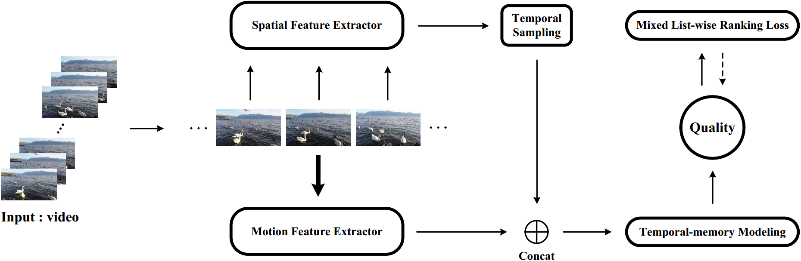

# BVQA-2021
Blindly Assess Quality of In-the-Wild Videos via Quality-aware Pre-training and Motion Perception

## Description
Source code for the following paper:

- Bowen Li, Weixia Zhang, Meng Tian, Guangtao Zhai, and Xianpei Wang. [Blindly Assess Quality of In-the-Wild Videos via Quality-aware Pre-training and Motion Perception] [[arxiv version]](https://arxiv.org/abs/2108.08505)


# Usage
## Install Requirements

```bash
python 3.8.8
pytorch 1.8.1
pytorch-ignite 0.4.1
torchsort 0.1.3
torchvision 0.9.1
Matlab R2020a
Successfully tested on Ubuntu18.04.
(Our machine is equipped with Intel Xeon(R) Gold 5220R CPU×2, and NVIDIA Quadro RTX6000 24G GPU×2.)
```

## Download VQA Databases
Download the [KoNViD-1k](http://database.mmsp-kn.de/konvid-1k-database.html), [CVD2014](https://www.mv.helsinki.fi/home/msjnuuti/CVD2014/), [LIVE-Qualcomm](http://live.ece.utexas.edu/research/incaptureDatabase/index.html), [LIVE-VQC](http://live.ece.utexas.edu/research/LIVEVQC/index.html), [YouTube-UGC](https://github.com/vztu/BVQA_Benchmark), and [LSVQ](https://github.com/baidut/PatchVQ) datasets. Then, run the following `ln` commands in the root of this project.

```bash
ln -s KoNViD-1k_path KoNViD-1k # KoNViD-1k_path is your path to the KoNViD-1k dataset
ln -s CVD2014_path CVD2014 # CVD2014_path is your path to the CVD2014 dataset
ln -s LIVE-Qualcomm_path LIVE-Qualcomm # LIVE-Qualcomm_path is your path to the LIVE-Qualcomm dataset
ln -s LIVE-VQC_path LIVE-VQC # LIVE-VQC_path is your path to the LIVE-VQC dataset
ln -s YouTube-UGC_path YouTube-UGC # YouTube-UGC_path is your path to the YouTube-UGC dataset
ln -s LSVQ_path LSVQ # LSVQ_path is your path to the LSVQ dataset
``` 

## Spatial Fearure: Transfer Knowledge from Quality-aware Pre-training
#### Sampling image pairs from multiple IQA databases
```bash
data_all_4inthewild.m
```
#### Combining the sampled pairs to form the training set
```bash
combine_train_4inthewild.m
```
#### Training on multiple IQA databases for 10 sessions
```bash
# Prepare source IQA databases
ln -s /&source_root/BID/ImageDatabase /&tartget_root/BVQA-2021/SpatialExtractor/IQA_database/BID/ImageDatabase
ln -s /&source_root/ChallengeDB_release/Images /&tartget_root/BVQA-2021/SpatialExtractor/IQA_database/ChallengeDB_release/Images
ln -s /&source_root/koniq-10k/1024x768 /&tartget_root/BVQA-2021/SpatialExtractor/IQA_database/koniq-10k/1024x768
ln -s /&source_root/SPAQ/TestImage /&tartget_root/BVQA-2021/SpatialExtractor/IQA_database/SPAQ/TestImage

# Start Training
python Main.py --train True --network basecnn --representation NOTBCNN --ranking True --fidelity True --std_modeling True --std_loss True --margin 0.025 --batch_size 128 --batch_size2 32 --image_size 384 --max_epochs 3 --lr 1e-4 --decay_interval 3 --decay_ratio 0.1 --max_epochs2 12
```
#### Feature extraction
Notice: Fisrt set the best model path you have trained in "get_spatialextractor_model.py". We provide a sample of pre-trained weights here:

Baidu Link: https://pan.baidu.com/s/1fakwlrv2pqRbMZLeRFRz9g   code: wk9r
 
```bash
CUDA_VISIBLE_DEVICES=0 python CNNfeatures_Spatial.py --database=KoNViD-1k --frame_batch_size=64
CUDA_VISIBLE_DEVICES=1 python CNNfeatures_Spatial.py --database=CVD2014 --frame_batch_size=64
CUDA_VISIBLE_DEVICES=0 python CNNfeatures_Spatial.py --database=LIVE-Qualcomm --frame_batch_size=8
CUDA_VISIBLE_DEVICES=1 python CNNfeatures_Spatial.py --database=LIVE-VQC --frame_batch_size=8
CUDA_VISIBLE_DEVICES=0 python CNNfeatures_Spatial.py --database=YouTube-UGC --frame_batch_size=8
CUDA_VISIBLE_DEVICES=1 python CNNfeatures_Spatial.py --database=LSVQ --frame_batch_size=8
```

## Motion Fearure: Transfer Knowledge from Motion Perception

#### Prepare the pre-trained SlowFast model file in the directory "./MotionExtractor/checkpoints/Kinetics/"
[SlowFast_Model](https://dl.fbaipublicfiles.com/pyslowfast/model_zoo/kinetics400/SLOWFAST_8x8_R50.pkl)
#### Feature extraction
```bash
CUDA_VISIBLE_DEVICES=&gpu_id python CNNfeatures_Motion.py --database=&database --frame_batch_size=64
```

## Final Fearure: Feature Fusion of Spatial and Motion Features
```bash
CUDA_VISIBLE_DEVICES=&gpu_id python CNNfeatures_Fusion.py --database=&database --frame_batch_size=64
```

## Training and Evaluating on VQA Databases

```bash
# Training, under individual-dataset setting, for example 
python main.py --trained_datasets C --tested_datasets C
# Training, under mixed-database setting, for example
python main.py --trained_datasets K C L N --tested_datasets K C L N
```

## Analyse results

```bash
# Analysis, under individual-dataset setting, for example 
python result_analysis.py --trained_datasets C --tested_datasets C
# Analysis, under mixed-database setting, for example
python result_analysis.py --trained_datasets K C L N --tested_datasets K C L N
```

## Test Demo

The model weights provided in `models/model_XXX` are the saved weights when best performing in training.
```bash
# Testing, under individual-dataset setting, for example 
python test_demo.py --trained_datasets C --model_path models/model_C --video_path=data/test.mp4
# Testing, under mixed-database setting, for example
python test_demo.py --trained_datasets K C L N --model_path models/model_KCLN --video_path=data/test.mp4
```

## Acknowledgement

This cobebase is heavily inspired by [MDTVSFA](https://github.com/lidq92/MDTVSFA) (Li et al., IJCV2021).

The model-based transfer learning for video feature extraction mainly follows the implementations of [UNIQUE - IQA domain](https://github.com/zwx8981/UNIQUE) (Zhang et al., TIP2021) and [SlowFast - Action Recognition domain](https://github.com/facebookresearch/SlowFast) (Feichtenhofer et al., ICCV2019).

Great appreciation for their excellent works.

## Citation

Should you find this repo useful to your research, we sincerely appreciate it if you cite our paper :blush: :
```bash
@article{li2021blindly,
  title={Blindly Assess Quality of In-the-Wild Videos via Quality-aware Pre-training and Motion Perception},
  author={Li, Bowen and Zhang, Weixia and Tian, Meng and Zhai, Guangtao and Wang, Xianpei},
  journal={arXiv preprint arXiv:2108.08505},
  year={2021}
}
```
